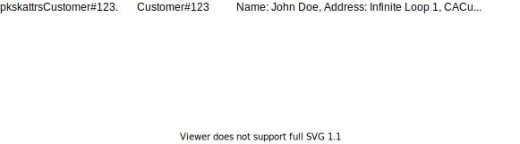
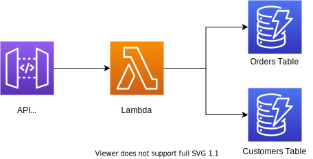
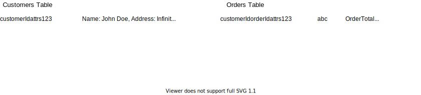
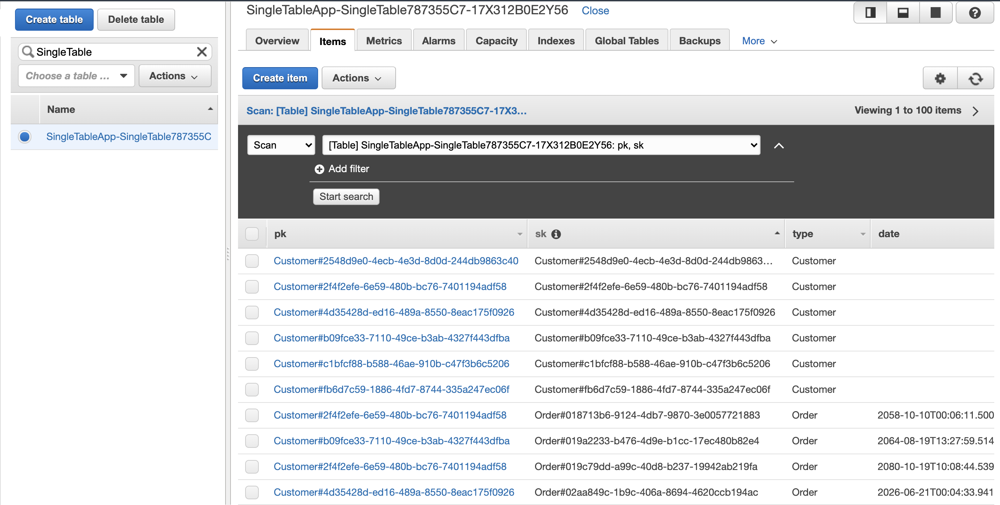
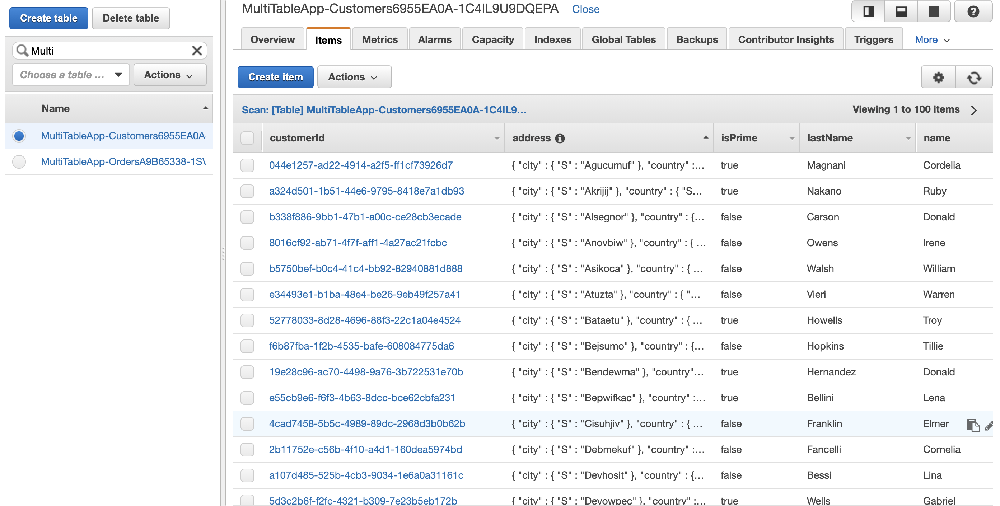
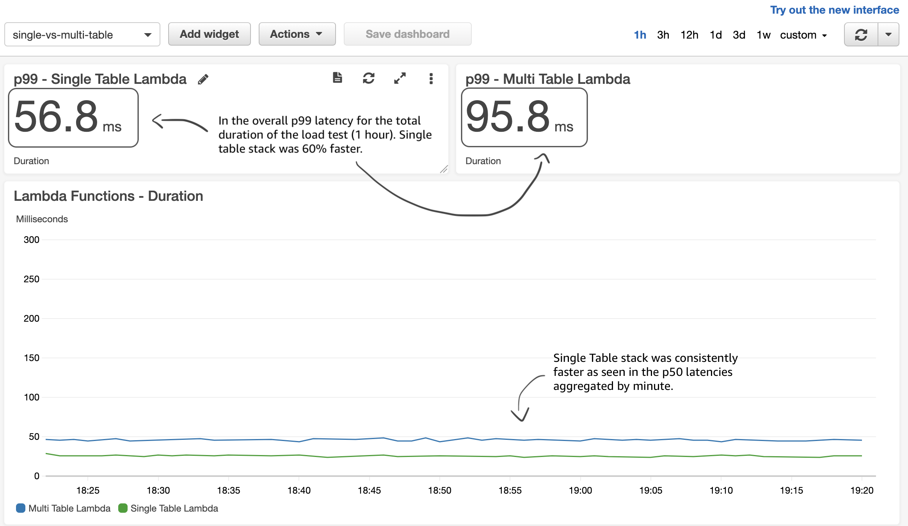
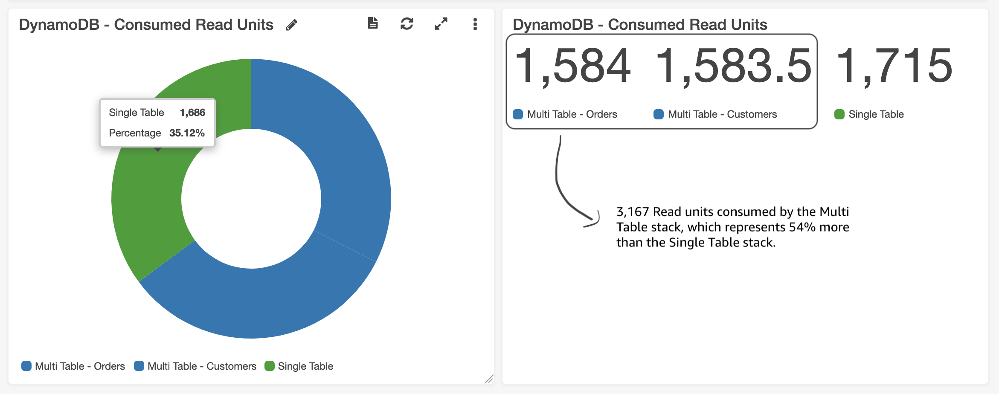

# Single Table DynamoDB Experiment

This repository is an implementation of the _Orders and Customers_ example showed in Alex Debrie's blog post about the [Single Table design with DynamoDB](https://www.alexdebrie.com/posts/dynamodb-single-table). The source code is an AWS CDK application that deploys 2 different Serverless applications, one that uses a single table and another one that uses separate tables for _customers_ and _orders_.

## Single Table Stack

The single table stack deploys the following resources. Essentially both entities in the data model are stored in the same DynamoDB table.

<p align="center">
  
</p>

#### Table Schema

As the single table pattern describes, you store the data in a way that optimizes your read access patterns. In this case, we can retrieve both the Customer information along with the customer Orders with the same query where `pk=Customer#123`.

<p align="center">
  
</p>

## Multiple Table Stack

The multiple table stack deploys the following resources. Essentially, each entity in the data model has its own DynamoDB table. This is comparable to how one would design the schema in a SQL database.

<p align="center">
  
</p>

#### Table Schema

<p align="center">
  
</p>

## The Experiment

The goal of this experiment was to determine how much better is having a single table design versus having multiple tables in terms of performance and cost. –– Is it really worth it?

#### Dummy Data

I loaded all my tables with some dummy data to simulate a decent amount of _Customers_ and _Orders_. The Single Table had a total of **1,462,033 items** and 203.93 MB of storage.

<p align="center">
  <figure>
    
    <figcaption>Screenshot of the Single Table in the console</figcaption>
  </figure>
</p>

Then I loaded the exact same entries into the multiple tables stack, except they were obviously divided into separate tables. The _Customers_ table had a total of 79,170 items and 11.20 MB of storage and the _Orders_ table had a total of 1,382,854 items and 172.76 MB of storage.

<p align="center">
  <figure>
    
    <figcaption>Screenshot of the Customers Table in the console</figcaption>
  </figure>
</p>

#### Load Testing

Once the dummy data was loaded into DynamoDB, I generated some traffic to both applications using [Newman CLI](https://github.com/postmanlabs/newman). In order to make it more realistic, I created a [CSV file](loadtest/customers.csv) with 10k random customer IDs that already existed in DynamoDB and I iterated over those to make sure I was retrieving a different customer on every request –– just in case there was any sort of caching involved at any layer.

#### Results

The results were somewhat obvious and expected. The Single Table stack only performs 1 query against DynamoDB to fetch all data needed to serve a request. Compared to the Multi Table stack which has to perform 2 separate queries to fetch the same data; logically, the single table would be more efficient.

**Load Test Duration**: 60 minutes

| Stack              | p50 Latency | p99 Latency |
| ------------------ | ----------- | ----------- |
| Single Table Stack | 24 ms       | 56.8 ms     |
| Multi Table Stack  | 46 ms       | 95.8 ms     |

**Latency Comparisson**

<p align="center">
  <figure>
    
    <figcaption>Screenshot of CloudWatch dashboard showing latency comparisson</figcaption>
  </figure>
</p>

**Cost Comparisson**

The biggest surprise in the results was the difference in Read Units consumed, because I expected to see the same amount of units consumed in both stacks, as they were both reading the exact same Customers and Orders on every request.

However, as can seen in the CloudWatch metrics below, **the Multi Table stack consumed 54% more Read Units** than the Single Table stack. In other words, the Single Table design was 54% more cost effective.

<p align="center">
  <figure>
    
    <figcaption>Screenshot of CloudWatch dashboard showing DynamoDB read units comparisson</figcaption>
  </figure>
</p>

The reason why the Multi Table stack consumed almost double the Read Units is because [DynamoDB counts read units](https://docs.aws.amazon.com/amazondynamodb/latest/developerguide/HowItWorks.ReadWriteCapacityMode.html#HowItWorks.requests) by rounding up the size of your query response to 4KB increments for strongly consistent reads or 2KB increments for eventually consistent ones. For our experiment, our item size was on average 350 bytes only, so each of our queries was returning no more than 2KB of data but they were still being rounded up for metering of the Consumed Read Units.

#### Code

Another aspect of this experiment was to see how complicated was to write code that fetches multiple heterogenous entities in the same DynamoDB table. Specially because the single table uses attribute names that are not descriptive by themselves (i.e. `pk` and `sk`) and their value depends on the type of entity.

I defined a few Typescript entity models that I shared among both stacks:

```js
export interface Customer {
  customerId: string;
  name: string;
  lastName: string;
  isPrime: boolean;
  orders: Array<Order>;
  address: {
    street: string,
    city: string,
    state: string,
    country: string,
  };
}

export interface Order {
  orderId: string;
  customerId: string;
  date: Date;
  total: number;
}
```

I had to write a few converter functions to map a Typescript object into a DynamoDB item and viceversa. An example of the Customer object being converted to a DynamoDB item is the following:

```js
function toItem(customer: Customer): CustomerDynamoDBItem {
  return {
    pk: `Customer#${customer.customerId}`,
    sk: `Customer#${customer.customerId}`,
    type: "Customer",
    name: customer.name,
    lastName: customer.lastName,
    address: customer.address,
    isPrime: customer.isPrime,
  };
}
```

The opposite function that converts an item into a Customer object:

```js
function fromItem(item: CustomerDynamoDBItem): Customer {
  return {
    customerId: item.pk.substring("Customer#".length),
    name: item.name,
    lastName: item.lastName,
    isPrime: item.isPrime,
    address: item.address,
    orders: [],
  };
}
```

Here is an example of using those functions to parse the query results:

```js
async function fetchCustomerWithOrders(customerId: string): Promise<Customer> {
  const result = await dynamodb
    .query({
      TableName: SINGLE_TABLE,
      KeyConditionExpression: "#pk = :pk",
      ExpressionAttributeNames: { "#pk": "pk" },
      ExpressionAttributeValues: {
        ":pk": "Customer#".concat(customerId),
      },
    })
    .promise();

  if (!result.Items || result.Items.length <= 0) {
    throw new Error("Customer not found");
  }

  // Find the customer item
  const customerItem = result.Items.find((item) => item.type === "Customer");

  // Find the order items
  const orderItems = result.Items.filter((item) => item.type === "Order");

  // Convert the customer item into a Customer object
  const customer = CustomerFactory.fromItem(customerItem as CustomerDynamoDBItem);

  // Convert the order items into Order objects
  const orders = orderItems.map((i) => OrderFactory.fromItem(i as OrderDynamoDBItem));
  customer.orders = orders;

  return customer;
}
```

## Conclusion

As expected, the Single Table design gives you **much better latency** in your applications simply because you are doing less requests to DynamoDB. But it also can be **more cost effective** as it may consume less Read Units than a multiple table approach. The only small downside is the need for that additional layer in your code that converts and marshalls DynamoDB items into your domain model objects, but with proper code organization, it should be a thin layer that doesn't really add much complexity to your codebase.

Alex Debrie describes other benefits and downsides in his blog post https://www.alexdebrie.com/posts/dynamodb-single-table that you should consider as well.
